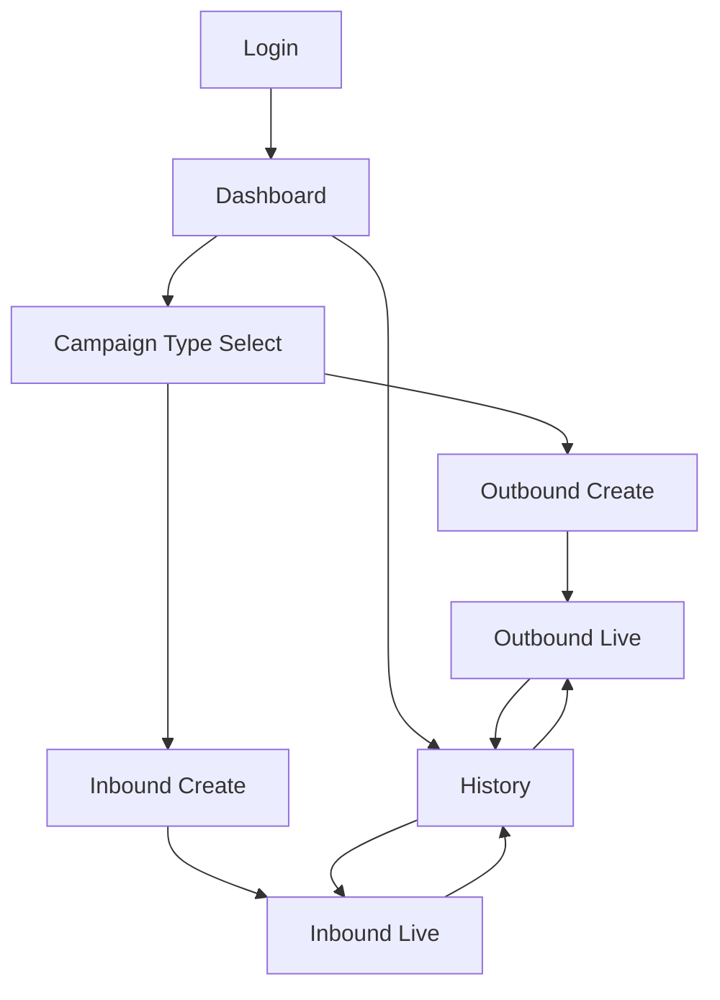

# UI Flow Documentation

## 1. User Authentication Flow

### Login Screen
- User navigates to `/auth/login`
- Enters username and password
- On successful authentication:
  - JWT token is stored in localStorage
  - User is redirected to Dashboard (`/`)

### Registration (Optional)
- User navigates to `/auth/register`
- Enters username, email, and password
- On successful registration:
  - User is redirected to Login screen

## 2. Dashboard Flow

### Main Dashboard (`/`)
- Displays key metrics:
  - Active calls count
  - Total campaigns
  - Success rate
- Contains "Create New Agent" button
- Clicking "Create New Agent" navigates to Campaign Type Selection

## 3. Campaign Creation Flow

### Campaign Type Selection (`/campaigns`)
- Tabs for Outbound and Inbound campaigns
- Each tab shows:
  - Description of campaign type
  - Key features
  - Use cases
  - "Create" button
- Clicking "Create" navigates to Campaign Creation form

### Campaign Creation Form (`/campaigns/create?type={type}`)
- Form fields:
  - Campaign Name (required)
  - Campaign Type (read-only, from URL parameter)
  - Campaign Goal (required, multiline text)
- Buttons:
  - "Create Campaign" (submits form)
  - "Cancel" (returns to previous screen)
- On successful creation:
  - User is redirected to Campaign Live Screen

## 4. Outbound Campaign Flow

### Outbound Live Screen (`/campaigns/outbound/{id}`)
- Header with campaign name and status indicator
- Two-column layout:
  - Left column: Active Calls section
    - Shows real-time active calls
    - Each call displays:
      - Lead name
      - Phone number
      - Call status (ringing, in-progress, completed, failed)
      - Duration timer
      - "End Call" button (for active calls)
    - Campaign control buttons:
      - "Pause Campaign" (when active)
      - "Start Campaign" (when paused)
  - Right column: Live Transcript section
    - Real-time conversation transcript
    - Color-coded by speaker (AI Agent vs Lead)
- Completed Calls section (below columns):
  - Lists completed calls with same information as active calls

## 5. Inbound Campaign Flow

### Inbound Live Screen (`/campaigns/inbound/{id}`)
- Header with campaign name and status indicator
- Two-column layout:
  - Left column: Incoming Calls section
    - Shows real-time incoming calls
    - Each call displays:
      - Caller name (if known) or "Unknown"
      - Phone number
      - Call status (ringing, in-progress, completed, failed)
      - Duration timer
      - "End Call" button (for active calls)
    - Campaign control buttons:
      - "Pause Campaign" (when active)
      - "Start Campaign" (when paused)
  - Right column: Live Transcript section
    - Real-time conversation transcript
    - Color-coded by speaker (AI Agent vs Caller)
- Recent Calls section (below columns):
  - Lists recent completed calls

## 6. Campaign History Flow

### Campaign History (`/history`)
- DataGrid showing all campaigns:
  - Columns: ID, Name, Type, Status, Created Date, Leads Count
  - Status indicators with color coding
  - Action buttons: "View", "Export"
- "Create New Campaign" button (top right)
  - Navigates to Campaign Type Selection

## 7. Component Interactions

### RAG Upload Zone
- Used in campaign setup flows
- Supports drag-and-drop file upload (PDF, DOCX)
- Supports URL input for web content
- Provides file type validation

### Lead CSV Uploader
- Used in outbound campaign setup
- Supports drag-and-drop CSV upload
- Shows preview of first 5 leads
- Validates required columns (name, phone)

### Active Call Card
- Displays call information
- Shows real-time duration updates
- Provides "End Call" functionality
- Status-based color coding

### Transcript Viewer
- Displays conversation transcript
- Real-time updates during calls
- Speaker-based color coding
- Auto-scrolls to latest message

## 8. Navigation Flow Diagram

## 9. State Management

### Authentication State
- JWT token stored in localStorage
- Token refreshed periodically
- Redirects to login when token expires

### Campaign State
- Managed via useCampaigns hook
- Real-time updates through API polling
- Local state for form inputs

### Call State
- Real-time updates through WebSocket (future implementation)
- Currently simulated with setInterval
- Call status transitions (ringing → in-progress → completed/failed)

### Transcript State
- Updated in real-time during calls
- Stored per call session
- Cleared when call ends